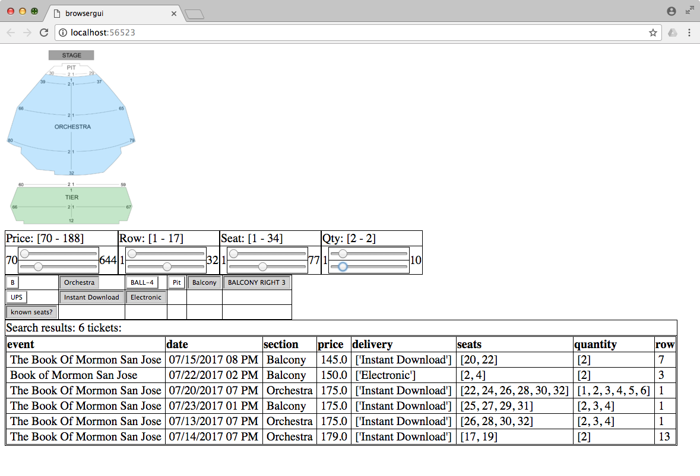
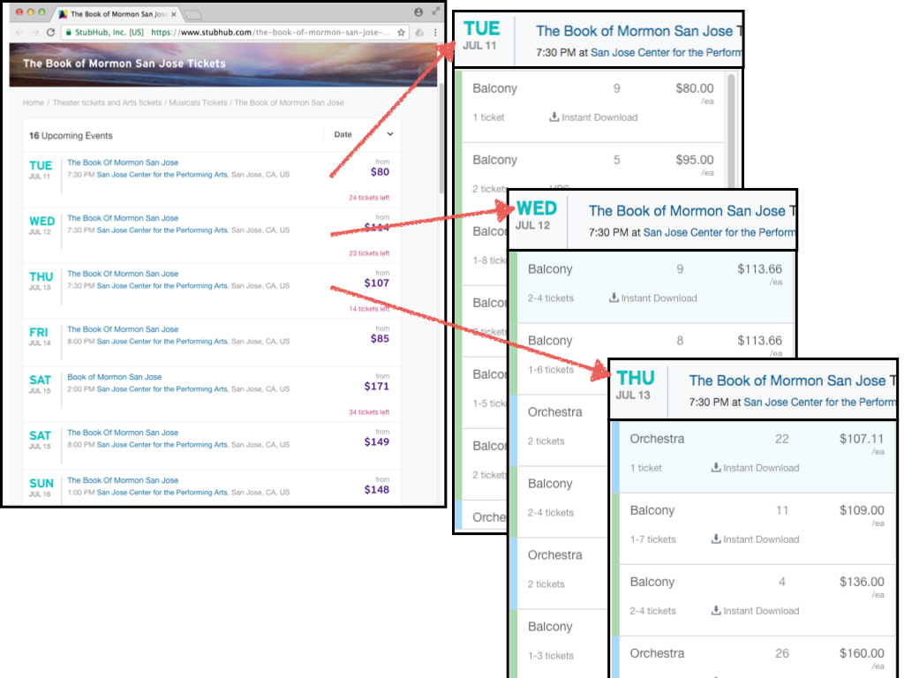

# StubHub Ticket Search GUI

A browser-based GUI for downloading and searching through concert tickets from the StubHub online ticket marketplace.

This program does 3 things:

1. Given a StubHub URL that lists events, download each event page's HTML (which contains ticket data for that event).
2. Parse each event's HTML to obtain ticket data.
3. Present all the ticket data in a browser-based GUI. You use this GUI to search the ticket data to find good tickets.

Notes:

- This project requires [browsergui](github.com/speezepearson/browsergui) -- an excellent lightweight browser-based GUI framework. Install with 
    - `easy_install browsergui`
    - or
    - `pip3 install browsergui`

- Running `main.py` will show you the GUI running with some example ticket data.

# Why needed?

The StubHub website interface has some problems:

- can't search across multiple events
- can't search for certain rows
- can't search for certain seats within row
- can't search for certain sections

[Example:](https://www.stubhub.com/the-book-of-mormon-san-jose-tickets/performer/1496118/)

